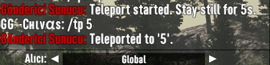
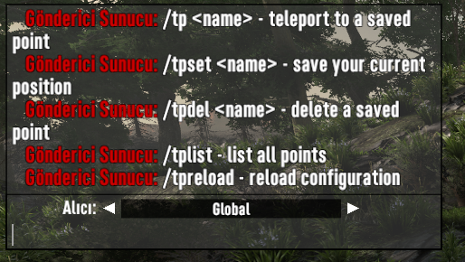

# CHAOS RELICS — Advanced Teleport Mod

**FAST. SAFE. SURVIVE.**

Chaos Relics Advanced Teleport is a teleport system built for dedicated and community servers, with configurable delay, cooldown, safety checks, permission-based commands, localization support, and optional Discord logging. This mod requires launching with EAC disabled.

## ✨ Features

| | |
|---|---|
| 🎯 **Safe Teleport** | Destination validation blocks teleports into unsafe locations |
| ⏱️ **Delay & Cooldown** | Configurable teleport delay, cooldown, and optional currency cost |
| 🧍 **Movement Cancellation** | Teleport is canceled if the player moves during the delay |
| 🔒 **Permission-Based Commands** | Enable or disable each command individually |
| ⚙️ **Fully Configurable** | Tune every behavior through `config.json` |
| 🌐 **Localization** | Ships with 20+ language files, with built-in fallback for missing keys |
| 📡 **Discord Logging** | Optional webhook logging of teleport activity |
| 🖥️ **Server Ready** | Player-owned teleport points, stored separately per player |

## 📦 Installation

1. Place the mod files in your server mod directory.
2. Ensure the following files are present:
   - `ChaosRelics-AdvancedTeleport.dll`
   - `config.json`
   - `lang/` directory
3. Launch or restart the server with EAC disabled.
4. Adjust settings in `config.json` to match your server rules.

## ⚙️ Configuration

The main configuration file is `config.json`. Key options include:

| Option | Description |
|---|---|
| `TeleportDelay` | Seconds to wait before a teleport completes |
| `Cooldown` | Seconds a player must wait between teleports |
| `Cost` | Currency cost charged on a successful teleport |
| `AllowPlayerTeleport` | Enables/disables player-initiated teleports |
| `AllowTeleportDuringBloodMoon` | Allows teleporting while a blood moon is active |
| `CancelOnMovement` | Cancels the teleport if the player moves during the delay |
| `SafeTeleport` | Validates that the destination is a safe location |
| `LogTeleports` | Logs teleport activity to the server console |
| `Language` | Localization language code (see `lang/`) |
| `DiscordWebhookUrl` | Webhook URL for optional Discord logging |

## 💬 Commands

| Command | Description |
|---|---|
| `/tp <name>` | Teleport to a saved point |
| `/tpset <name>` | Save your current position as a teleport point |
| `/tpdel <name>` | Delete a saved teleport point |
| `/tplist` | List all saved teleport points |
| `/tpreload` | Reload configuration and localization (disabled by default) |
| `/tphelp` | Show the in-game help menu |

Each command can be individually enabled or disabled via `CommandPermissions` in `config.json`.

## 🖼️ Screenshots

  
  
  

## 📁 Project Structure

- `ChaosRelics-AdvancedTeleport.dll` - compiled mod component
- `config.json` - runtime configuration
- `lang/` - localization files
- `manifest.xml` / `ModInfo.xml` - mod metadata

## 📜 License

This project is licensed for personal, in-game use only. Redistribution, reuploading, sharing, or public use is not permitted without written permission from the author. See the [LICENSE](LICENSE) file for details.
