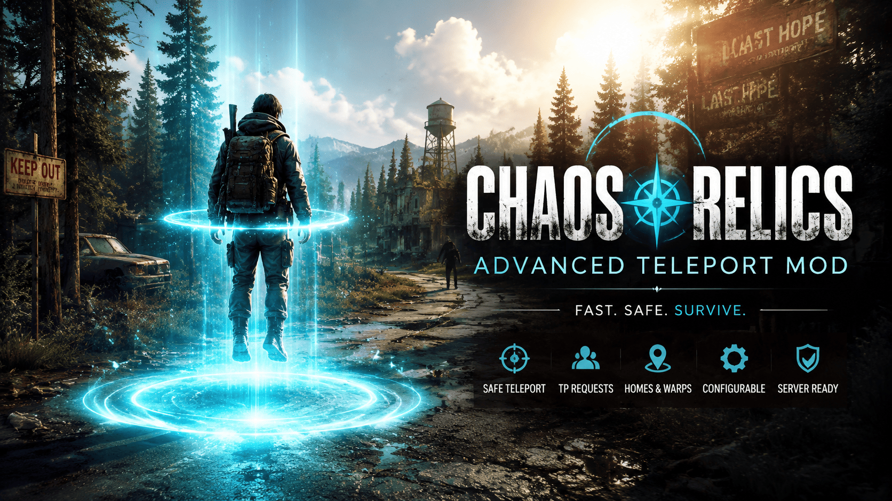

# Chaos Relics - Advanced Teleport

Chaos Relics Advanced Teleport is a teleport system that can run on both client-side and server-side setups, with configurable delay, cooldown, safety checks, permission-based commands, localization support, and optional Discord logging. This mod requires launching with EAC disabled.

## Features

- Delayed teleports with configurable timing
- Cooldown and optional cost handling
- Movement cancellation during teleport delay
- Safety checks for teleport destinations
- Permission-based command access
- Localization support through language files
- Optional Discord webhook logging

## Installation

1. Place the mod files in your server mod directory.
2. Ensure the following files are present:
   - AdvancedTeleport.dll
   - config.json
   - lang/ directory
3. Launch or restart the server with EAC disabled.
4. Adjust settings in config.json to match your server rules.

## Configuration

The main configuration file is config.json. Key options include:

- TeleportDelay
- Cooldown
- Cost
- AllowPlayerTeleport
- AllowTeleportDuringBloodMoon
- CancelOnMovement
- SafeTeleport
- LogTeleports
- Language
- DiscordWebhookUrl

## Commands

Common commands include:

- /tp
- /tpset
- /tpdel
- /tplist
- /tphelp

## Project Structure

- AdvancedTeleport.dll - compiled mod component
- config.json - runtime configuration
- lang/ - localization files
- manifest.xml / ModInfo.xml - mod metadata

## License

This project is licensed for personal, in-game use only. Redistribution, reuploading, sharing, or public use is not permitted without written permission from the author. See the LICENSE file for details.
